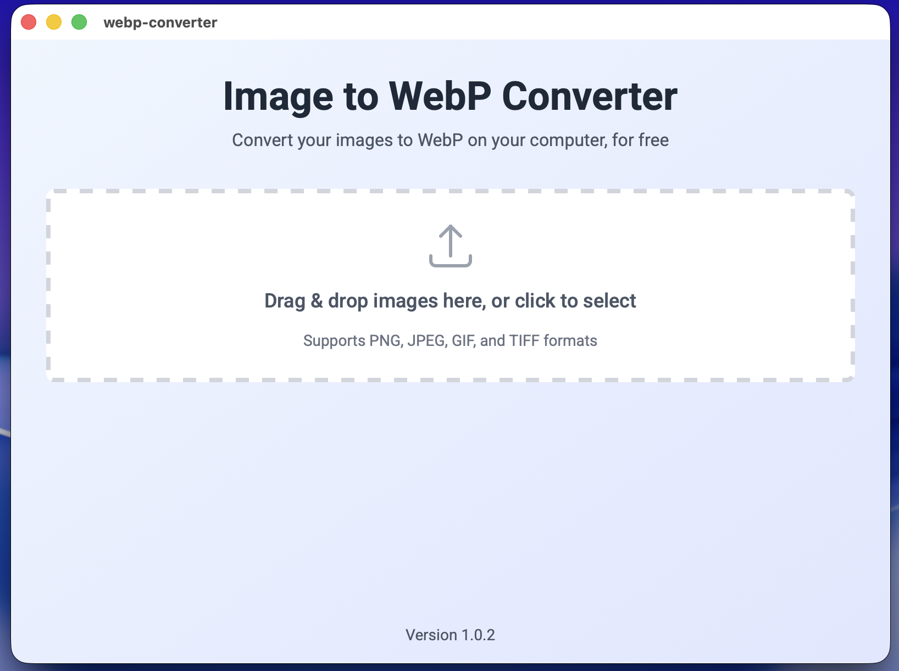
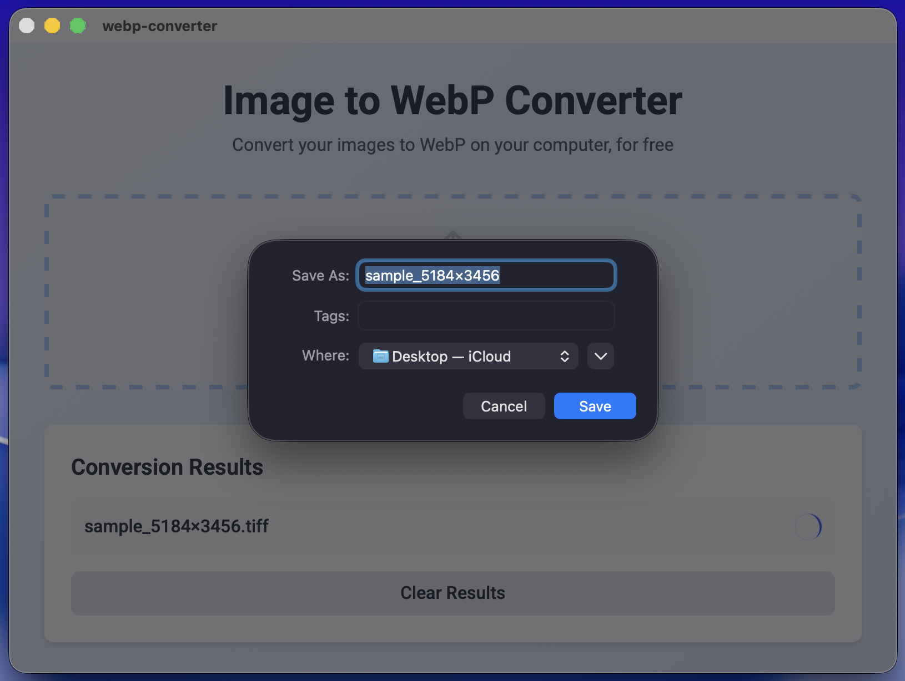
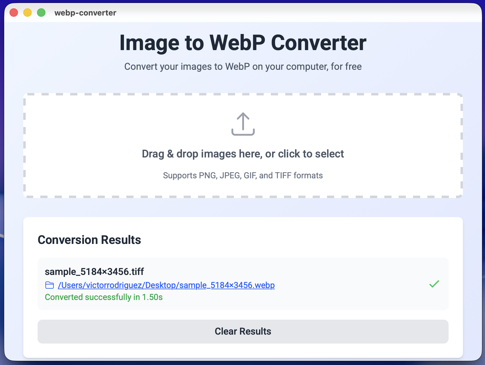
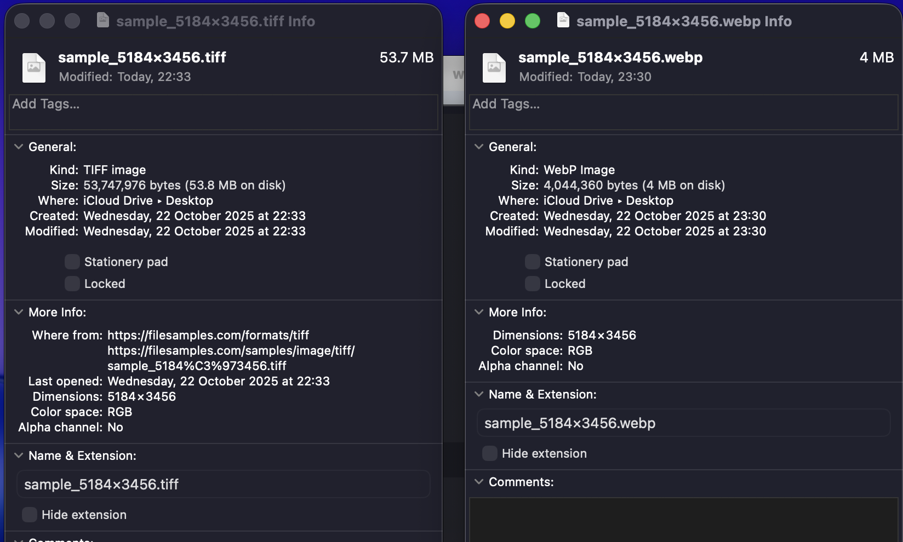

# WebP Converter

A simple desktop app to convert images to WebP format. No upload, no limits, no BS.



## Why this exists

`cwebp` is amazing but typing commands gets old fast. If you're a frontend dev, designer, or just someone who needs to convert images without dealing with terminals or sketchy online converters, this is for you.

## Features

- **Drag & drop** - Just drop your images and pick where to save
- **100% private** - Everything happens on your computer, nothing uploaded
- **Fast** - Uses the same cwebp binary, but easier
- **Free forever** - No ads, no limits, no account needed
- **Simple** - One job, done well

## Supported formats

Converts **PNG, JPEG, GIF, TIFF** → **WebP**

## Installation

### Download Pre-built Releases

Download the latest version from the [Releases page](https://github.com/victor0899/webp-converter/releases/latest):

- **macOS (Apple Silicon - M1/M2/M3):** Download `.dmg` file

> **Note:** Currently only available for Apple Silicon Macs. Intel Mac users can build from source below.

#### macOS Security Warning

When you first open the app, macOS will show a warning that the app is "damaged" or can't be opened. This is normal for unsigned apps.

**To fix this:**

1. Open **Terminal** (Applications → Utilities → Terminal)
2. Run this command:
   ```bash
   xattr -cr /Applications/webp-converter.app
   ```
3. Now you can open the app normally

**Why this happens:** This app is not signed with an Apple Developer certificate ($99/year). The app is safe, macOS just doesn't recognize it. This is common for free open-source apps.

### Build from Source

If you prefer to build it yourself:

**Requirements:**
- Node.js / pnpm
- Rust / Cargo (for Tauri)

**Build it yourself:**
```bash
git clone https://github.com/victor0899/webp-converter.git
cd webp-converter
pnpm install
pnpm tauri build
```

The app will be in `src-tauri/target/release/bundle/`

## How to use

1. Open the app
2. Drag images or click to select
3. Choose where to save
4. Done

## Screenshots

### Converting Images


### Conversion Results


### Reveal in Finder


## Tech stack

- **Frontend:** React + TypeScript + Tailwind CSS
- **Backend:** Tauri (Rust)
- **Conversion:** cwebp binary

## License

This project is licensed under the **GNU General Public License v3.0** (GPL-3.0).

This means:
- You can use, modify, and distribute this software
- If you improve it, you must share your changes under the same license
- You must include the source code with any distribution

See the [LICENSE](LICENSE) file for full details.

## Contributing

Feel free to improve it! Just remember: if you share your version, you need to share the code too (that's the GPL). This is meant to help people, not make money.

---

Made because typing `cwebp input.jpg -o output.webp` gets tedious
